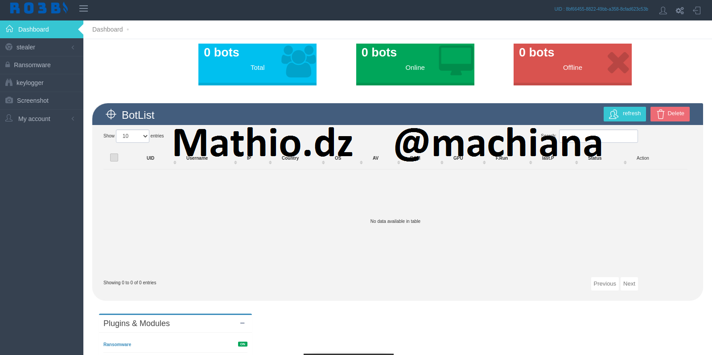
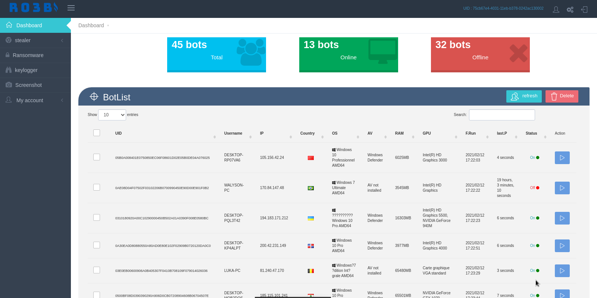
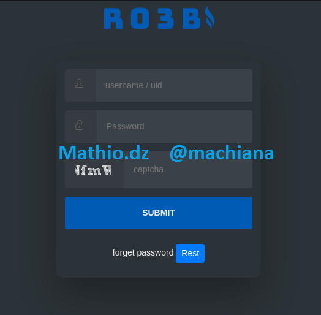
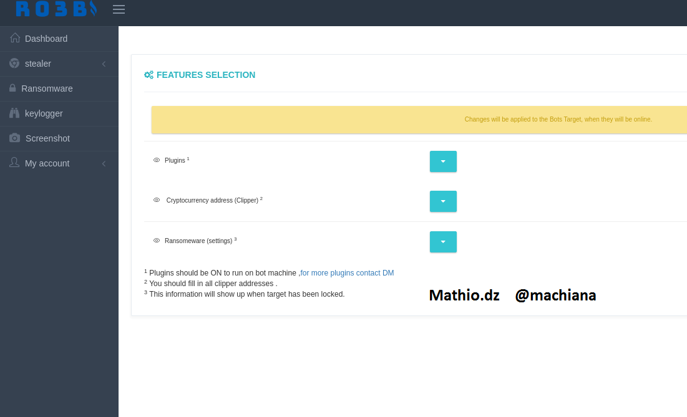
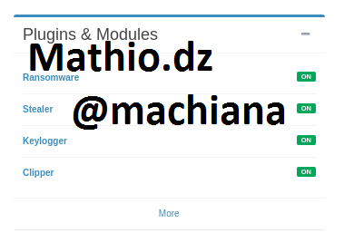

# HTTP Banking Botnet Ro3b 

<a target="_blank" href="https://github.com/mathio3/Ro3b-HTTP-botnet/">
  
   

#### By mathio.dz
#### Telgram : @machiana
#### XMPP : ro3b@conversations.im (disconnected) 
#### Discord : machiana@8470

# Update : 2021 - 02 - 03
# WebGrabbing :
	# PayPal Email - Password 
	# Grab credit card - cvv 
# Features : 
- Remote code execution * CMD - powershell *  
- Stealer  - Credit Card # Password # Cookies 
  

	
<code>Browser supported based on chromeium : </code> 
- Chrome  - Chromium   - Edge   - Maxthon3   - YandexBrowser  - Opera   - Sputnik   - Mail.Ru    - Brave   - ChromePlus   - Iridium   - 7Star  - epicPrivacyBrowser  - CentBrowser  - ElementsBrowser  - Chedot  - Vivaldi  - Kometa  - uCozMedia  - Sleipnir5  - Citrio  - Coowon  - liebao  - QIP.Surf  - Orbitum  - Amigo  - Torch  - Comodo  - 360Browser  - Nichrome  - CocCoc  - Uran  - Chromodo   

  

	
<code>Browser supported based on Firefox : </code> 
 - Firefox   - Waterfox   - K-Meleon   - Thunderbird   - IceDragon   - Cyberfox   - BlackHaw   - PaleMoon 

    - Credit Card	[ Full name - card number - cvv - date expired - card type  ]
    - Password	[ Website - username - password ]
    - Cookies	[ Host - cookies content - expired date  ]

- Clipper 
  

	
<code>Wallet supported  : </code> 
- Bitcoin - Ethereum - Monero - Stellar - Ripple - Litecoin - Neocoin - Bitcoin Cash - Bytecoin - Cardano - Graft - Zcash - Bitcoin Gold - Waves - ReddCoin - BlackCoin - Emercoin - Stratis - Qtum - Viacoin - Lisk - Dogecoin - Dashcoin    

- Ransomware (encrypt files using AES256  )
- Advance Keylogger (send data realtime )
- Download file and execution
- Autorun - Mutex - AntiVM - AntiScan

####  Video Demo : https://youtu.be/sy2wP4rz6gY

